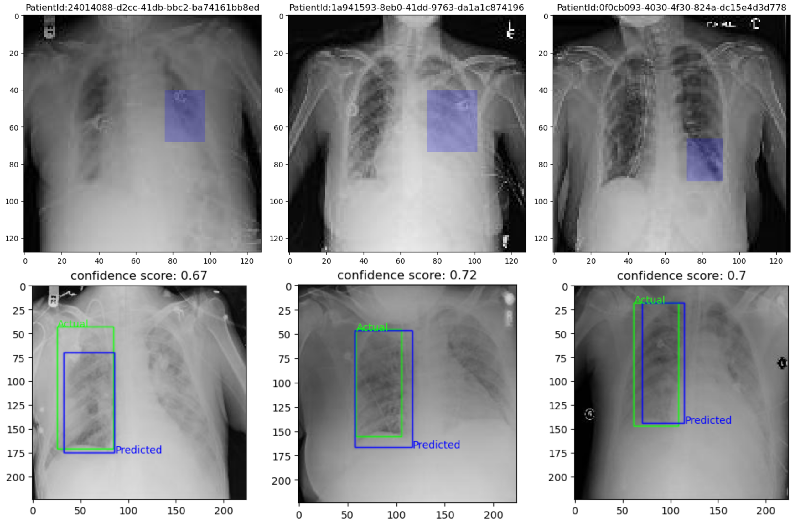

# Pneumonia Detection

## Computer Vision: Pneumonia Detection from X-ray images

 The project comprises of <b>26,684 X-ray images</b> classified as Normal, Lung Opacity and No Lung Opacity/ Not normal. The objective is to design and develop an <b>object detection model</b> to classify patients suffering from Pneumonia and <b>predict its bounding boxes</b>. 
  

## ML libraries/Architectures: 
TensorFlow, CNN, R-CNN, YOLOv8, Transfer learning (VGG16, ResNET50)
